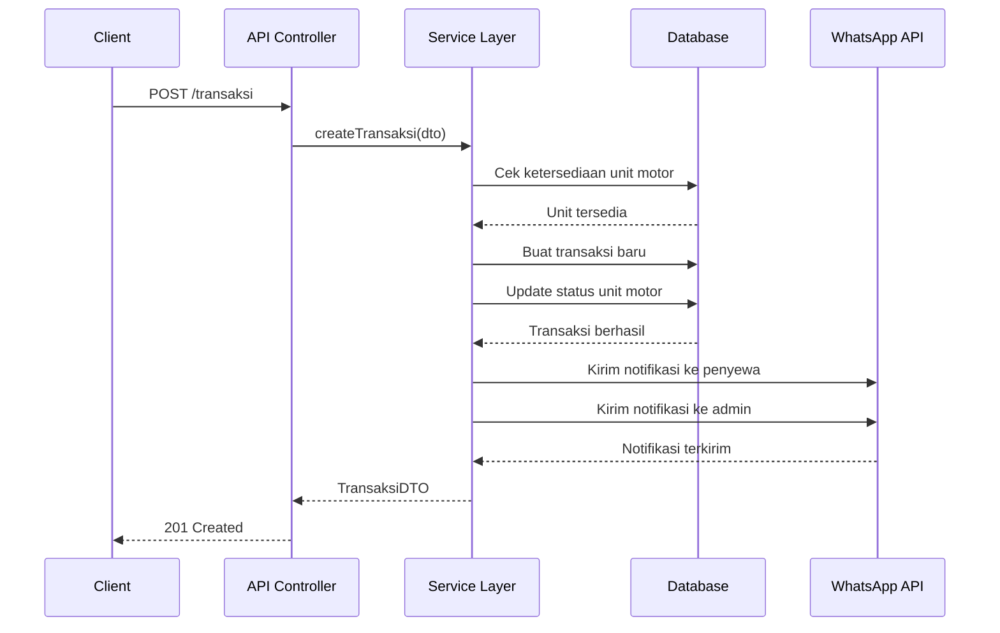
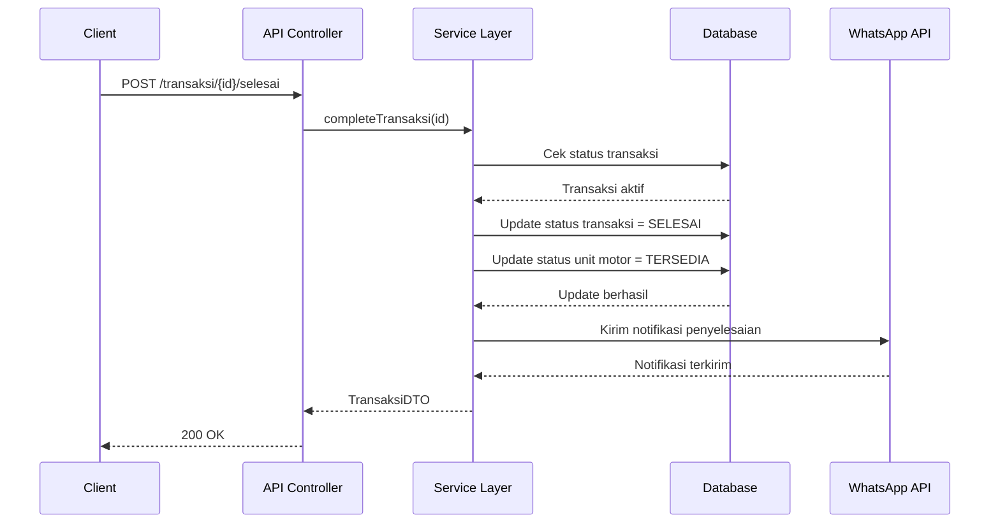

# Arsitektur Aplikasi Rental Motor

Dokumen ini memberikan penjelasan tentang arsitektur aplikasi rental motor.

## Komponen Utama

Arsitektur aplikasi terdiri dari beberapa komponen utama:

1. **API Layer** - NestJS Controllers
   - Mengimplementasikan endpoint REST API
   - Menangani validasi input menggunakan DTO
   - Mendelegasikan pemrosesan ke Service Layer

2. **Service Layer**
   - Mengimplementasikan logika bisnis
   - Menggunakan Repository Pattern untuk akses data
   - Menangani transaksi database
   - Mengirim notifikasi ke sistem eksternal

3. **Repository Layer** (via Prisma)
   - Menyediakan akses ke database
   - Menangani transformasi data
   - Mengimplementasikan caching

4. **External Services**
   - WhatsApp API untuk notifikasi
   - Redis untuk caching dan pub/sub
   - Bull Queue untuk task yang berjalan di background

## Aliran Data

### Aliran Sewa Motor

### Aliran Penyelesaian Sewa

## Struktur Database

Aplikasi menggunakan PostgreSQL sebagai database dengan skema berikut:

1. **JenisMotor** - Menyimpan informasi jenis dan model motor
2. **UnitMotor** - Menyimpan informasi unit motor fisik
3. **TransaksiSewa** - Menyimpan data transaksi penyewaan
4. **Admin** - Menyimpan informasi admin
5. **BlogPost** - Menyimpan konten blog
6. **BlogTag** - Menyimpan tag untuk blog
7. **BlogPostTag** - Relasi many-to-many antara blog dan tag

## Cara Kerja Autentikasi

Aplikasi menggunakan JWT (JSON Web Token) untuk autentikasi:

1. Admin melakukan login dengan username dan password
2. Server memeriksa kredensial di database
3. Jika valid, server menghasilkan JWT dengan payload yang berisi ID admin
4. Token ini dikirim ke client dan harus disertakan di header Authorization pada setiap request
5. Server memvalidasi token pada setiap request ke endpoint yang terlindungi

## Penanganan Error

1. HTTP Status Code yang sesuai untuk setiap jenis error
2. Format respons error yang konsisten
3. Logging error di server untuk monitoring
4. Rate limiting untuk mencegah serangan brute force

## Optimasi Performa

1. **Caching** - Redis digunakan untuk caching data yang sering diakses
2. **Pooling Database** - Menggunakan Prisma connection pooling
3. **Pagination** - Semua endpoint yang mengembalikan banyak data mendukung pagination
4. **Indexing** - Index pada kolom database yang sering dicari
5. **Compression** - Kompres response HTTP menggunakan algoritma Gzip/Deflate

## Referensi Teknis

- [NestJS Documentation](https://docs.nestjs.com/)
- [Prisma Documentation](https://www.prisma.io/docs/)
- [Redis Documentation](https://redis.io/documentation)
- [Bull Queue Documentation](https://github.com/OptimalBits/bull/blob/master/REFERENCE.md) 